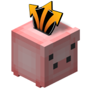

# Clans\[Banks]
### An official [Clans\[Free\]](https://github.com/Hempfest/Clans) addon
[**Spigot**](https://www.spigotmc.org/resources/clans-banks-addon-for-clans-free.87018/)
|
[**Wiki**](https://github.com/ms5984/ClansBanks/wiki)

Officially released!
Pick it up right [here](https://github.com/ms5984/ClansBanks/releases)!

Stay tuned for updates. We announce changes and offer assistance
with plugin setup on our support Discord: https://discord.gg/hubcommunity

_Discord Tutorial_
-
Join via the link above. If this is your first time joining us, you will be
contacted by the Utility bot in the `welcome` channel of the 
---\| (📢) 𝓢𝓣𝓐𝓡𝓣 𝓗𝓔𝓡𝓔 \|--- category. Proceed to 🟢-support-🟢 as directed and
react with a wrench to gain access to the ---\| SUPPORT \|--- category.

You may also check out the ---\[ INFO ]--- category for Updates.

_Fellow developers:_
-
If you would like to share feedback about this project (suggest new
features, changes, or let us know about or correct a bug), feel free to open
a new issue right [here](https://github.com/ms5984/ClansBanks/issues/new).
Please pick an appropriate label. Thanks!
